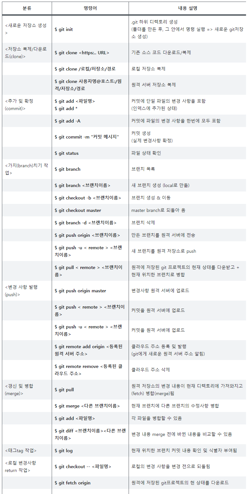

GitHub 사용법
======================

<p align="center"></p>

## 목차(Index)
>### 1. Git & GitHub
>### 2. GitHub 용어정리
>### 3. Git 명령어 모음
>### 4. Repository 생성하기

## 1. Git & GitHub
----
### - Git: 소스코드 변경사항을 효율적으로 관리하기 위한 분산형 버전 관리 시스템  
### - Github : Git을 기반으로 하는 데이터 저장소  


### 1-1. Git
#### 1) 기본개념
#### 단순히 마지막 작업내용만을 저장하는 것이 아니라, 전부 복제(clone)하는 방식 따라서 서버에 문제가 생겨도  
#### 해당 복제물로 다시 작업 가능 기존 델타 기반의 VCS와 달리 GIT은 데이터를 '연속되는 스냅샷'과 같은 개념으로 저장 시간 순서대로 저장

#### 2) GIT의 상태
#### (1) Committed : 데이터가 로컬 데이터베이스에 안전하게 저장됐다는 것

#### (2) Modified : 수정한 파일을 아직 로컬 데이터베이스에 커밋하지 않은 것

#### (3) Staged : 현재 수정한 파일을 곧 커밋할 것이라고 표시한 상태  


```
=> 보통 파일 및 폴더를 working tree 라고 부르며, 여기에서 파일을 수정
=>  commit을 실행하기 전의 repository와 working tree 사이는 staging area 또는 index. 
=> commit과정은 모든 수정사항을 repository에 모두 저장하는 것이 아닌, staging area에 저장.
=> 이 staging area 에서 필요 여부에 따라 commit
=> staging area에 있는 파일들을 git de commit하여 스냅샷으로 저장
```

#### 3) GIT의 장점
- 변경사항에 대한 추적 가능 (수정, 삭제, 비교, 되돌아가기 등)
- Github을 통한 공유의 편리성
- 2인 이상 협업시 개발의 편리성

## 2. GitHub 용어정리
----
### 2-1. 용어정리
#### 1) Commit
> 깃에 데이터가 저장되어 온 기록(파일 추가, 변경 등)을 남기는 행위<br/> - 변경한 시간 순서대로 저장  <br/>- 영문과 숫자로 이루어진 40자리 이름으로 각 commit 구분

#### 2) Repository
> 저장소
>> 2-1) Remote Repository (원격저장소)<br/>원격 저장소 서버에서 관리 (for 협업)
>> <br/>2-2) Local Repository (로컬저장소)<br/>개인 컴퓨터 서버에 저장 (for 개인)

#### 3) Head
> 현재 commit한 소스코드

#### 4) Branch
> 코드를 여러개로 복사한 후, 이전의 코드와는 독립적으로 개발하는 것

#### 5) Push
> 로컬 저장소의 수정사항을 원격 저장소에 업로드 하는 행위

#### 6) Pull
> 원격 저장소에서 로컬 저장소로 다운로드 하는 행위 

#### 7) Work Tree
> 폴더

#### 8) Index
>커밋을 실행하기 전의 저장소와 작업 트리에 존재하는 공간으로, 모든 변경사항이 포함된 파일들의 집합<br/>- 인덱스에 존재하는 파일 중 선택적으로 commit

## 3. Git 명령어 모음
----
### 3-1. Git 명령어



### 3-2. CLI 명령어


### 3-3. 추가 작업

* branch에 기존 작업코드 복사하고 push하기
  * branch 생성 후 이동 : git checkout -b expressPrac
  * 확인 : git status
  * push 하기 : git push origin expressPrac
  
  
## 4. Repository 생성하기
----
<<<<<<< HEAD

=======
>>>>>>> 0eb8f6137f17b8720cd00d0768555d079187efed

#### 1) Owner : 본인
#### 2) Repository name : 파일명 작성
#### 3) Description : (opt) 만들고자 하는 파일에 대한 간략 설명
#### 4) Public : 저장소 공개 (무료)
#### 5) Private : 저장소 비공개 (유료)
#### 6) Initialize this repository with a README : (opt) 저장소 설명을 위한 파일 생성 여부
<<<<<<< HEAD


#### 7) Add file -> Upload files : 작업한 파일 업로드


=======
#### 7) Add file -> Upload files : 작업한 파일 업로드
>>>>>>> 0eb8f6137f17b8720cd00d0768555d079187efed
#### 8) Drag additional files or click button 'choose your files' : 파일 선택
#### 9) check your uploaded files : 업로드한 파일 확인
#### 10) commit changes : 해당 파일에 대한 간략 설명 (opt) 및 파일 커밋
#### 11) 수정사항이 있을 때마다 파일 Commit

> commit : 저장소에 소스 코드의 일부의 최신 변경사항을 추가함으로써 이러한 변경사항을 저장소의 최상위 리비전(head revision)의 일부분으로 만들어주는 것


